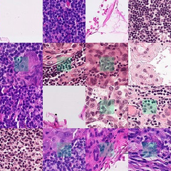
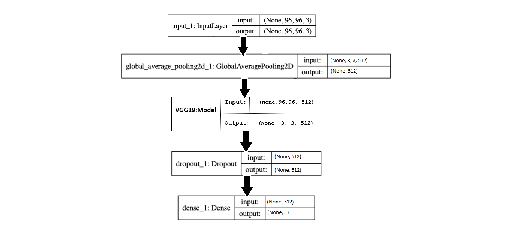
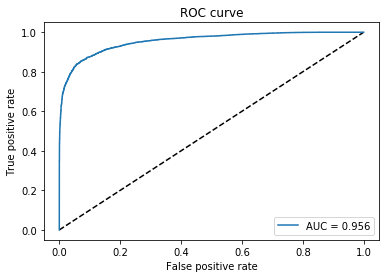

# Histopathology-Cancer-Detection

<h3 align="center">
  
</h3>

Python Jupyter Notebook leveraging **Transfer Learning**  , **Convolutional Neural Networks**  , **Test Time Augmentation** implemented with **Keras**. 
 

Submitted [Kernel](https://www.kaggle.com/greg115/histopathologic-cancer-detector-lb-0-958) with 0.9669 LB score.

## Data

**Dataset:** [Link](https://www.kaggle.com/vishal22/histopathology)

**Description:**  A binary classifier contains a tumor or not is trained in order to effectively identify metastatic cancer in small image patches taken from larger digital pathology scans. The binary classifier relies on the idea of transfer learning implemented as VGG19 where existing convolutional neural network layers are reused to extract general feature information. The advantage of this algorithm specially with larger datasets like ImageNet is the ability to improvise the speed of the training process as we start with pre-trained weight matrix. In order to further enhance the performance, augmentation techniques are used on training images and also TTA(Test Time Augmentation) is used while testing the Images on the model. We obtained an accuracy rate of 96.69 when the model was trained for 90k images, where the validation set consisted of 10k images and the test set has 57k images with 12 epochs.

**Training:** 90k (0.9) images

**Validation:** 10k (0.1) images

**Testing:** 57.5k images

## Model
<h3>
  
</h3>

            _________________________________________________________________
          Layer (type)                 Output Shape              Param #   
          =================================================================
          input_1 (InputLayer)         (None, 96, 96, 3)         0         
          _________________________________________________________________
          vgg19 (Model)                (None, 3, 3, 512)         20024384  
          _________________________________________________________________
          global_average_pooling2d_1 ( (None, 512)               0         
          _________________________________________________________________
          dropout_1 (Dropout)          (None, 512)               0         
          _________________________________________________________________
          dense_1 (Dense)              (None, 1)                 513       
          =================================================================
          Total params: 20,024,897
          Trainable params: 20,024,897
          Non-trainable params: 0
          _________________________________________________________________

<h3>
  
</h3>

## Results

Kaggle score: **0.9669**
